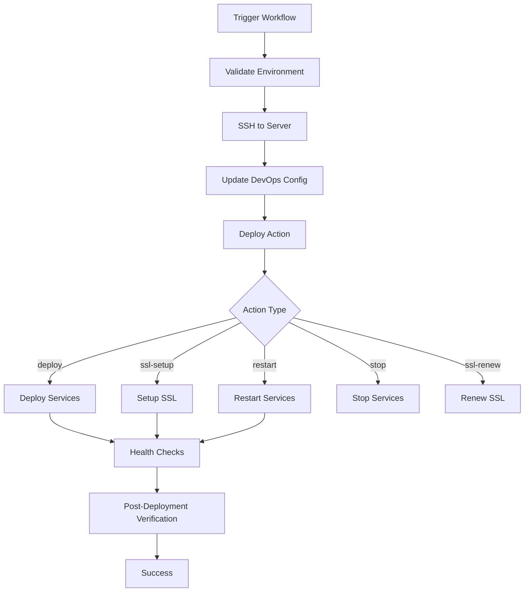

# Cach Connect Deployment Workflows

This document describes the GitHub Actions deployment workflows for the Cach Connect infrastructure.

## 🏗️ Workflow Overview

### Available Workflows

1. **Deploy Shared Infrastructure** (`deploy-shared.yml`)
   - Deploys monitoring stack (Grafana, Prometheus, Loki, Alertmanager)
   - Sets up reverse proxy (Nginx)
   - Manages SSL certificates
   - Configures log collection and alerting

2. **Deploy API** (`api/.github/workflows/deploy.yml`)
   - Deploys the Cach API backend service

3. **Deploy Agent App** (`agent/.github/workflows/deploy.yml`)
   - Deploys the Agent frontend application

## 🚀 Shared Infrastructure Deployment

### Workflow Triggers

The shared infrastructure workflow can be triggered manually with these options:

#### Environment Options:
- **production**: Deploy to production environment
- **staging**: Deploy to staging environment
- **sandbox**: Deploy to sandbox environment

#### Action Options:
- **deploy**: Full deployment of monitoring stack
- **restart**: Restart all shared services
- **stop**: Stop all shared services
- **ssl-setup**: Setup SSL certificates
- **ssl-renew**: Renew SSL certificates

### Deployment Process



### Branch Restrictions

- **Production**: Only `main` branch can deploy to production
- **Staging**: Only `staging` branch can deploy to staging
- **Sandbox**: Any branch can deploy to sandbox

## 📋 Prerequisites

### GitHub Secrets Required

Set these secrets in your GitHub repository:

```bash
VPS_HOST=your-server-ip-or-domain
VPS_USER=your-ssh-username
VPS_SSH_PASSWORD=your-ssh-password
```

### Server Prerequisites

1. **Docker & Docker Compose**: Installed and running
2. **SSH Access**: GitHub Actions can SSH to the server
3. **Directory Structure**: `/opt/cach/` directory exists
4. **Permissions**: User can run Docker commands

## 🔧 Usage Examples

### 1. Deploy Full Monitoring Stack

```yaml
# Trigger via GitHub UI
Environment: production
Action: deploy
```

This will:
- Deploy Prometheus, Grafana, Loki, Alertmanager, Nginx
- Configure networking and volumes
- Run health checks
- Provide access URLs

### 2. Setup SSL Certificates

```yaml
# Trigger via GitHub UI
Environment: production
Action: ssl-setup
```

This will:
- Obtain Let's Encrypt certificates for all domains
- Configure nginx with SSL
- Set up auto-renewal

### 3. Restart Services

```yaml
# Trigger via GitHub UI
Environment: staging
Action: restart
```

This will:
- Restart all monitoring services
- Verify they come back healthy

## 📊 Deployed Services

After successful deployment, these services will be available:

### Monitoring Services
- **Grafana**: https://grafana.cachconnect.co.ke
  - Username: `admin`
  - Password: Set in `.env.monitoring`
- **Prometheus**: http://your-server:9090
- **Alertmanager**: http://your-server:9093
- **Loki**: http://your-server:3100 (internal)

### Application Services (via Nginx)
- **API Production**: https://api.cachconnect.co.ke
- **API Staging**: https://api.staging.cachconnect.co.ke
- **Admin Production**: https://admin.cachconnect.co.ke
- **Admin Staging**: https://admin.staging.cachconnect.co.ke
- **Agents Production**: https://agents.cachconnect.co.ke
- **Agents Staging**: https://agents.staging.cachconnect.co.ke
- **Distributors Production**: https://distributors.cachconnect.co.ke
- **Distributors Staging**: https://distributors.staging.cachconnect.co.ke
- **Business Production**: https://businesses.cachconnect.co.ke
- **Business Staging**: https://business.staging.cachconnect.co.ke
- **Lenders Production**: https://lenders.cachconnect.co.ke
- **Lenders Staging**: https://lenders.staging.cachconnect.co.ke

## 🔍 Health Checks

The workflow includes comprehensive health checks:

### Service Health Checks
- **Prometheus**: `GET /-/healthy`
- **Grafana**: `GET /api/health`
- **Loki**: `GET /ready`
- **Alertmanager**: `GET /-/healthy`

### Post-Deployment Verification
- Container status verification
- Network connectivity tests
- Service endpoint accessibility
- SSL certificate validation

## 🚨 Troubleshooting

### Common Issues

1. **Service Failed to Start**
   ```bash
   # Check logs via GitHub Actions output or SSH
   docker-compose -f docker-compose.shared.yml logs service-name
   ```

2. **Health Check Failures**
   ```bash
   # Check service status
   docker-compose -f docker-compose.shared.yml ps
   
   # Test endpoints manually
   curl -f http://localhost:9090/-/healthy
   ```

3. **SSL Certificate Issues**
   ```bash
   # Check certificate status
   docker run --rm -v $(pwd)/ssl/certs:/etc/letsencrypt certbot/certbot certificates
   ```

### Manual Recovery

If the GitHub Actions deployment fails, you can recover manually:

```bash
# SSH to server
ssh user@your-server

# Navigate to shared directory
cd /opt/cach/shared

# Run local deployment script
./scripts/deploy-shared.sh production deploy
```

## 🔄 Workflow Updates

To update the deployment workflow:

1. Modify the workflow file in your devops repository
2. Commit and push changes
3. The next deployment will use the updated workflow

### Local Testing

Test deployment scripts locally:

```bash
# In your local devops directory
./scripts/deploy-shared.sh sandbox deploy
```

## 📈 Monitoring the Deployment

### GitHub Actions Logs
- Monitor deployment progress in the GitHub Actions tab
- Check for any errors in the workflow steps
- Review post-deployment health check results

### Server Monitoring
- Use Grafana dashboards to monitor deployed services
- Check Prometheus targets for service discovery
- Review Loki logs for any deployment issues

## 🔒 Security Considerations

### Access Control
- SSH credentials stored as GitHub secrets
- Branch-based deployment restrictions
- Network isolation between environments

### SSL Management
- Automatic certificate renewal
- Production-grade cipher suites
- HSTS headers for security

### Container Security
- Non-root users where possible
- Resource limits configured
- Regular security updates via image pulls

---

**Last Updated**: 2024-01-XX
**Version**: 1.0.0
